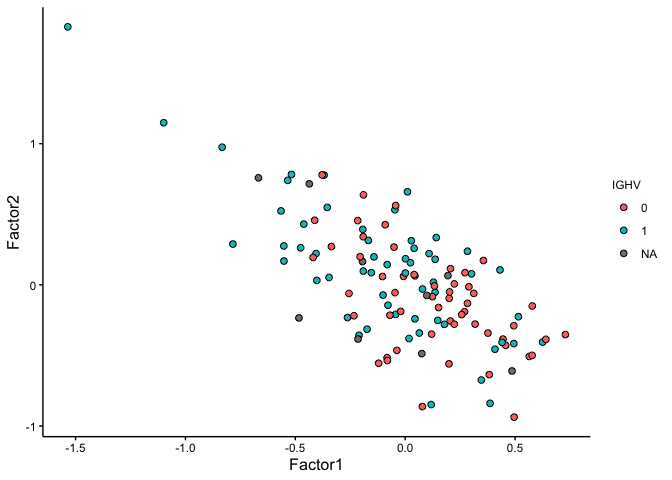
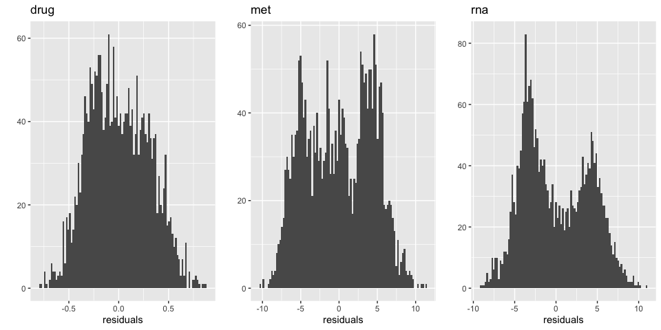

MOFA MCMC
================
Frederik Ziebell

# Preparations

``` r
suppressPackageStartupMessages({
  library("MOFA2")
  library("greta")
  library("cowplot")
  library("tidyverse")
})
## Warning: multiple methods tables found for 'aperm'
## Warning: replacing previous import 'BiocGenerics::aperm' by
## 'DelayedArray::aperm' when loading 'HDF5Array'
source("helper_functions.R")
theme_set(theme_cowplot())
```

# Load data

We load the MOFA model tained in `1_mofa_original.Rmd` and extract the
$W$ and $Z$ matrices.

``` r
mofa_obj <- load_model("mofa_obj_trained.hdf5")
## Warning in .quality_control(object, verbose = verbose): Factor(s) 1, 2 are strongly correlated with the total number of expressed features for at least one of your omics. Such factors appear when there are differences in the total 'levels' between your samples, *sometimes* because of poor normalisation in the preprocessing steps.
Y_drug <- mofa_obj@data$drug$group1
Y_met <- mofa_obj@data$met$group1
Y_rna <- mofa_obj@data$rna$group1

Z_mofa <- mofa_obj@expectations$Z$group1
W_drug_mofa <- mofa_obj@expectations$W$drug
W_met_mofa <- mofa_obj@expectations$W$met
W_rna_mofa <- mofa_obj@expectations$W$rna
```

As observed in the full dataset, there is good overlap between the
different views regarding explained variance. Factor 1 separates
patients by IGHV status. Apart from factors 1 and 2, there is little
correlation between the factors.

``` r
plot_variance_explained(mofa_obj)
```

<!-- -->

``` r
plot_factor_cor(mofa_obj)
```

<!-- -->

``` r
plot_factors(mofa_obj, color_by="IGHV")
```

<!-- -->

We check the approximation quality of the matrix factorizations by
computing the observed vs. predicted residuals of the data matrices.

``` r
W_drug_mofa <- mofa_obj@expectations$W$drug
W_met_mofa <- mofa_obj@expectations$W$met
W_rna_mofa <- mofa_obj@expectations$W$rna
Z_mofa <- mofa_obj@expectations$Z$group1

plot_grid(
  qplot(Y_drug - tcrossprod(W_drug_mofa,Z_mofa), bins=100) + labs(x="residuals", title="drug"),
  qplot(Y_met - tcrossprod(W_met_mofa,Z_mofa), bins=100) + labs(x="residuals", title="met"),
  qplot(Y_rna - tcrossprod(W_rna_mofa,Z_mofa), bins=100) + labs(x="residuals", title="rna"),
  nrow = 1
)
```

<!-- -->

# Define model

We implement the MOFA model with an ARD prior on the weights matrices,
but no spike-and-slab prior. This is consistent with the loaded MOFA
model, as stated in the `mofa_obj@model_options` slot.

``` r
# =====================================
# dimensions
# =====================================
# number of samples
N <- ncol(Y_drug) 
# number of factors
K <- ncol(Z_mofa) 
# number of features
D_drug <- nrow(Y_drug)
D_met <- nrow(Y_met)
D_rna <- nrow(Y_rna)

# =====================================
# data
# =====================================
# greta assumes observations in rows and variables in columns
Yt_drug <- t(Y_drug)
Yt_met <- t(Y_met)
Yt_rna <- t(Y_rna)

# =====================================
# hyperparameters
# =====================================
# Note: mofapy2 uses the shape = a, rate = b parametrization of the 
# Gamma distribution. This corresponds to the alpha = a, beta = b 
# parametrization of extraDistr::dinvgamma used by greta.
a0_alpha <- 1e-3
b0_alpha <- 1e-3
a0_tau <- 1e-14
b0_tau <- 1e-14

# ====================================
# priors
# ====================================

# creates a D x K greta array that defines the prior of a W matrix
define_W_prior <- function(D, K) {
  one_over_alpha <- inverse_gamma(alpha = rep(a0_alpha, K), beta = rep(b0_alpha, K))
  # D x K matrix where each row is a copy of one_over_alpha
  one_over_alpha_mat <- t(greta_array(rep(one_over_alpha, D), dim = c(K, D)))
  # W_hat
  normal(mean = zeros(D, K), sd = one_over_alpha_mat)
}

# creates a D x D greta array that defines the residual SD prior
# of a data matrix Y with D features
define_residual_prior <- function(D) {
  Sigma_Y <- zeros(D, D)
  diag(Sigma_Y) <- inverse_gamma(a0_tau, b0_tau, dim = D)
  Sigma_Y
}

# Z and W
Z <- normal(0, 1, dim = c(N, K))
## ℹ Initialising python and checking dependencies, this may take a moment.
## ✔ Initialising python and checking dependencies ... done!
## 
W_drug <- define_W_prior(D_drug, K)
W_met <- define_W_prior(D_met, K)
W_rna <- define_W_prior(D_rna, K)

# residuals
Sigma_Y_drug <- define_residual_prior(D_drug)
Sigma_Y_met <- define_residual_prior(D_met)
Sigma_Y_rna <- define_residual_prior(D_rna)

# =====================================
# likelihood
# =====================================
distribution(Yt_drug) <- multivariate_normal(Z %*% t(W_drug), Sigma_Y_drug)
distribution(Yt_met) <- multivariate_normal(Z %*% t(W_met), Sigma_Y_met)
distribution(Yt_rna) <- multivariate_normal(Z %*% t(W_rna), Sigma_Y_rna)

# =====================================
# model
# =====================================
m <- model(Z, W_drug, W_met, W_rna)
```

# MCMC sampling

``` r
set.seed(1)
draws <- mcmc(m, one_by_one = T, verbose = FALSE)
```

# Chain convergence

We assess the convergence of the four chains by randomly selecting 5
elements per matrix and inspecting their traceplots. There is almost no
mixing between the chains, indicating that the parameters of the model
are not identifiable, leading to chains that attain different local
optima of the posterior.

``` r
set.seed(5)
c(
  str_c("W_drug[",sample(1:nrow(W_drug),10,replace=T),",",sample(1:ncol(W_drug),10,replace=T),"]"),
  str_c("W_met[",sample(1:nrow(W_met),10,replace=T),",",sample(1:ncol(W_met),10,replace=T),"]"),
  str_c("W_rna[",sample(1:nrow(W_rna),10,replace=T),",",sample(1:ncol(W_rna),10,replace=T),"]"),
  str_c("Z[",sample(1:nrow(Z),10,replace=T),",",sample(1:ncol(Z),10,replace=T),"]")
) %>%
  bayesplot::mcmc_trace(draws, pars=.,facet_args = list(ncol = 5))
```

<!-- -->

# Explore MCMC model

The factors of the MCMC model fail to explain variance and to
disentangle the main source of variation in the data related to IGHV
status. This is potentially due to the *rotational invariance* problem
mentioned in the MOFA papers in conjunction with poor initial values.

``` r
mofa_obj_mcmc <- update_Z_and_W(mofa_obj, draws)
plot_variance_explained(mofa_obj_mcmc, use_cache = FALSE)
```

<!-- -->

``` r
plot_factor_cor(mofa_obj_mcmc)
```

<!-- -->

``` r
plot_factors(mofa_obj_mcmc, color_by="IGHV")
```

<!-- -->

Moreover, the MCMC model gives a worse solution of the factorization
problem, as the distribution of the residuals is much wider than the one
obtained by MOFA.

``` r
W_drug_mcmc <- mofa_obj_mcmc@expectations$W$drug
W_met_mcmc <- mofa_obj_mcmc@expectations$W$met
W_rna_mcmc <- mofa_obj_mcmc@expectations$W$rna
Z_mcmc <- mofa_obj_mcmc@expectations$Z$group1

plot_grid(
  qplot(Y_drug - tcrossprod(W_drug_mcmc,Z_mcmc), bins=100) + labs(x="residuals", title="drug"),
  qplot(Y_met - tcrossprod(W_met_mcmc,Z_mcmc), bins=100) + labs(x="residuals", title="met"),
  qplot(Y_rna - tcrossprod(W_rna_mcmc,Z_mcmc), bins=100) + labs(x="residuals", title="rna"),
  nrow = 1
)
```

<!-- -->

# MCMC with MOFA initial values

To assess the general validity of the MCMC implementation, we run the
model again, but this time with the data matrices obtained from MOFA as
initial values. The mixing between the chains is greatly improved.

``` r
set.seed(1)
inits <- initials(Z = Z_mofa, W_drug = W_drug_mofa, W_met = W_met_mofa, W_rna = W_rna_mofa)
draws <- mcmc(m, one_by_one = T, initial_values = inits, verbose = FALSE)
## only one set of initial values was provided, and was used for all chains

set.seed(5)
c(
  str_c("W_drug[",sample(1:nrow(W_drug),10,replace=T),",",sample(1:ncol(W_drug),10,replace=T),"]"),
  str_c("W_met[",sample(1:nrow(W_met),10,replace=T),",",sample(1:ncol(W_met),10,replace=T),"]"),
  str_c("W_rna[",sample(1:nrow(W_rna),10,replace=T),",",sample(1:ncol(W_rna),10,replace=T),"]"),
  str_c("Z[",sample(1:nrow(Z),10,replace=T),",",sample(1:ncol(Z),10,replace=T),"]")
) %>%
  bayesplot::mcmc_trace(draws, pars=.,facet_args = list(ncol = 5))
```

<!-- -->

Moreover, the second run of the model results in a factorization very
close to the original one found by MOFA, indicating that the solution of
MOFA is at a location of the posterior that is very hard to escape by
the MCMC sampler.

``` r
mofa_obj_mcmc <- update_Z_and_W(mofa_obj, draws)
plot_variance_explained(mofa_obj_mcmc, use_cache = FALSE)
```

<!-- -->

``` r
plot_factor_cor(mofa_obj_mcmc)
```

<!-- -->

``` r
plot_factors(mofa_obj_mcmc, color_by="IGHV")
```

<!-- -->

# Posterior optimization

Finally, we use greta’s capability to obtain the MAP via optimization.
The MAP model explains more variance than the MCMC model without initial
values. Factors are largely uncorrelated and there is some separation of
patients by IGHV status.

``` r
set.seed(1)
opt_res <- opt(m, optimiser = adam())

mofa_obj_opt <- update_Z_and_W_opt(mofa_obj, opt_res)
plot_variance_explained(mofa_obj_opt, use_cache = FALSE)
```

<!-- -->

``` r
plot_factor_cor(mofa_obj_opt)
```

<!-- -->

``` r
plot_factors(mofa_obj_opt, color_by="IGHV")
```

<!-- -->
